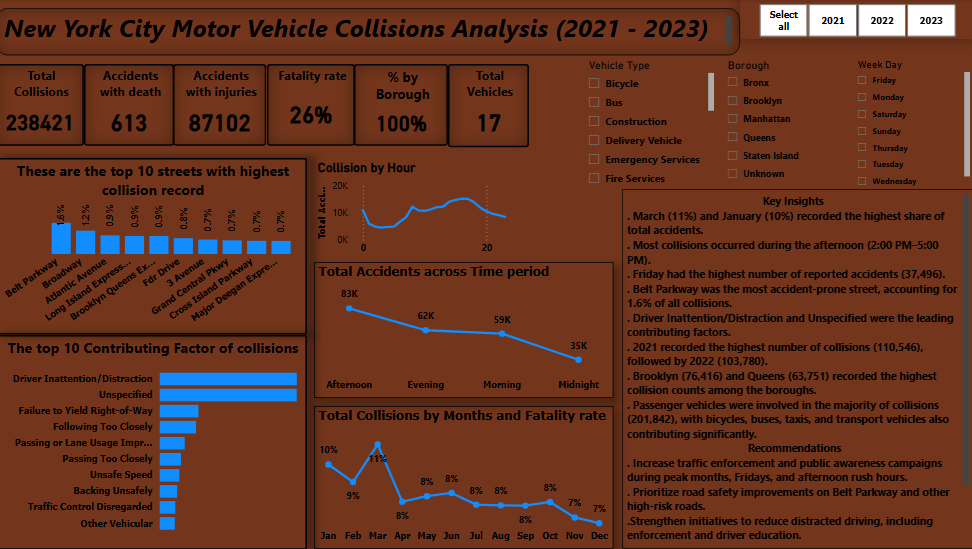
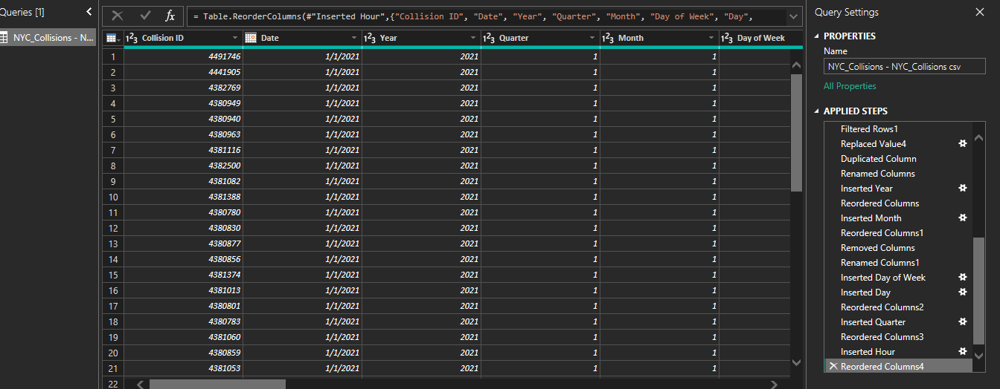

# NEW-YORK-CITY-MOTOR-VEHICLE-COLLISIONS-ANALYSIS
An exploratory analysis of collision trends, contributing factors and safety 

## EXECUTIVE SUMMARY

This report presents an exploratory analysis of motor vehicle collisions reported in New York City between 2021 and 2023. The objective was to identify collision trends across time, location and contributing factors while uncovering actionable insights that could support road safety initiatives and traffic management.

A total of 238,421 collisions were analyzed. These collisions resulted in 87,102 injuries and 613 fatalities, indicating that although most accidents were non-fatal, they still had a significant impact on public safety. 

The analysis found that collisions occurred most frequently during the afternoon rush hours, were highest on Fridays, and were predominantly caused by driver inattention/distraction and unspecified driver-related factors. Brooklyn recorded the highest number of collisions among all boroughs, while Belt Parkway emerged as the street with the highest collision frequency.

### Project Objectives 

The objectives of this analysis were to:

- Analyze monthly accident trends and identify seasonal patterns.
- Determine when accidents occur most frequently by day of the week and hour of the day.
- Identify the street with the highest number of reported collisions.
- Determine the most common contributing factors to collisions and fatal accidents.
- Generate additional insights that can support road safety improvements.

## DATASET DESCRIPTION

Each row in the dataset represents a single motor vehicle collision reported by the New York City Police Department.

The dataset contains the following information:

- Collision ID
- Date
- Time
- Borough
- Street Name
- Cross Street
- Latitude
- Longitude
- Vehicle Type
- Contributing Factor
- Persons Injured
- Persons Killed
- Pedestrians Injured/Killed
- Cyclists Injured/Killed
- Motorists Injured/Killed

### Data Preparation 

Before analysis, the dataset underwent several cleaning and transformation steps.

These included:

- Replacing missing values in the Borough column with "Unknown" to preserve all records.
- Creating Month, Weekday, and Time Period fields from the Date and Time columns.
- Grouping accident times into:
    - Morning
    - Afternoon
    - Evening
   - Midnight
- Validating numerical fields for injuries and fatalities.
- Removing unnecessary duplicates where applicable.
- Creating DAX measures for KPI calculations.

## METHODOLOGY

